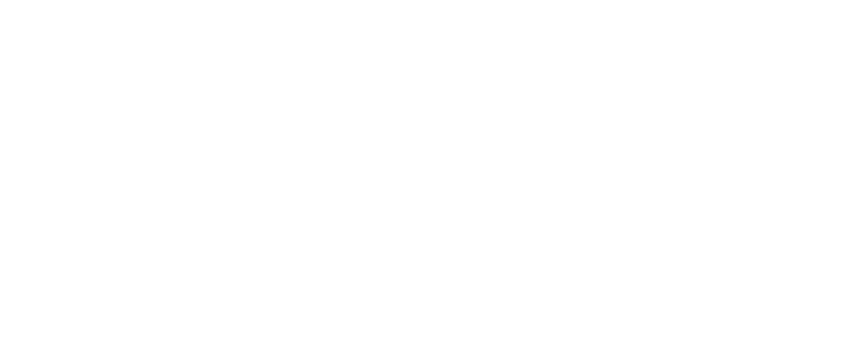

<!--
⚠️ README IS BEING REWRITTEN

The old OCS was removed in favor of `runvy_ecs`. See ROADMAP.md.
-->

# Runvy Engine

[](LICENSE-MIT)
[](LICENSE-APACHE)
[](https://www.rust-lang.org)

[](https://github.com/runvyengine/runvy)

Runvy Engine is an experimental **code-first** Rust game engine. The primary way to build a game is through typed, composable Rust APIs. An optional editor exists as a prototype and is currently frozen — all effort goes into stabilising the core engine first.

> Status: pre-alpha. APIs are still evolving. The runtime is usable for prototypes and internal tools, but the engine is not production-ready yet.
>
> **Strategic focus (v0.6+):** code-first core engine. The editor is frozen
> as a prototype until the core API stabilises (target: v0.10).
> See [`docs/architecture/strategic-direction.md`](docs/architecture/strategic-direction.md).

## What Runvy Is

Runvy is a workspace, not just one crate. It currently includes:

- `runvy_ecs`: archetype-based ECS (BlobVec storage, Fetch GAT queries, `#[system]` auto-registration)
- `runvy_core`: components, input, audio, console
- `runvy_app`: runtime app loop and window bootstrap
- `runvy_render`: `wgpu` renderer
- `runvy_asset`: asset loading helpers
- `runvy_engine`: umbrella crate for normal game-side usage

The runtime is code-first:

- `runvy_ecs::World` stores entities in archetypes
- components are plain Rust structs
- behavior is written with `#[system]` functions
- entities are composed explicitly in Rust code
- no registration step needed — just `world.spawn((components))`

## What Works Today

### Runtime

- archetype-based ECS with `runvy_ecs::World`
- `#[system]` auto-registration via `inventory`
- `world.spawn((...))` for composing components
- typed queries with `world.query::<(R<A>, R<B>)>()` and `world.query_mut::<W<A>>()`
- fixed-timestep scheduler in the app loop

### Rendering

- 2D sprite rendering
- tilemaps
- basic 3D mesh rendering
- unified camera component for 2D/3D
- offscreen render targets used by the editor

### Systems

- global input API
- window control from scripts
- basic audio and spatial audio
- simple 2D AABB collision detection with `Collider2D`
- cursor interaction

## Current Limits

- single runtime window only
- no full physics engine
- no mature animation pipeline
- 3D support is still basic
- ECS resources (`Time`, etc.) not yet implemented
- no command queue for deferred spawn/despawn
- generic serialization is not finished yet
- editor is frozen as a prototype (will be rewritten after core stabilises)
- API stability is not guaranteed between alpha revisions

## Quick Start

### Requirements

- Rust 1.75+
- GPU/backend supported by `wgpu`

### Run a bundled example

```bash
cargo run -p sandbox
```

### Add Runvy to a new project

Current latest public tag: [`v0.7.6`](https://github.com/runvyengine/runvy/releases/tag/v0.7.6)

```toml
[dependencies]
runvy_engine = { git = "https://github.com/runvyengine/runvy.git", tag = "v0.7.6" }
```

If you want to track the repository head instead of a tag:

```toml
[dependencies]
runvy_engine = { git = "https://github.com/runvyengine/runvy.git", branch = "main" }
```

## Quick Guide

Minimal startup:

```rust
use runvy_engine::{
    prelude::*,
    runvy_app::{RunvyApp, RunvyWindowConfig},
};

fn main() {
    let mut world = runvy_engine::runvy_ecs::World::new();

    world.spawn((
        Transform::default(),
        SpriteRenderer::new(None),
        Camera::new_orthographic(320.0, 180.0),
    ));

    let config = RunvyWindowConfig {
        title: "My Game".to_string(),
        width: 1280,
        height: 720,
        fullscreen: false,
        vsync: true,
        show_fps_in_title: true,
        window_icon: None,
    };

    let _ = RunvyApp::run_with_world(config, world);
}
```

Typical gameplay object:

```rust
use runvy_engine::prelude::*;
use runvy_engine::runvy_core::components::*;
use runvy_engine::system;

struct PlayerController {
    speed: f32,
}

#[system]
fn player_update(world: &mut runvy_ecs::World) {
    let dt = 1.0 / 60.0;
    for (_, (transform,)) in world.query_mut::<runvy_ecs::W<Transform>>() {
        transform.position += runvy_engine::runvy_core::glam::Vec3::X * 0.25 * dt;
    }
}

fn setup(world: &mut runvy_ecs::World) {
    world.spawn((
        Transform::default(),
        Camera::new_orthographic(320.0, 180.0),
        SpriteRenderer::new(Some(runvy_asset::load_image!("assets/art/player.png"))),
    ));
}
```

## How To Start Making A Game

1. Create a `World`.
2. Define your components as plain structs.
3. Write behavior with `#[system] fn my_system(world: &mut World)`.
4. Spawn entities with `world.spawn((...))`.
5. Run the app with `RunvyApp::run_with_world(config, world)`.

No registration step is needed — just `world.spawn((components))`.

Recommended project shape:

```text
src/
  main.rs
  player.rs
  enemy.rs
  world_setup.rs
assets/
```

Good practice in Runvy:

- keep entity composition in typed factory functions
- keep behavior in `#[system]` functions
- use typed marker/data components instead of string tags

> **Editor note:** The editor is currently frozen as a prototype (see
> [`strategic-direction.md`](docs/architecture/strategic-direction.md)).
> The notes below describe the prototype's current behaviour and will
> be relevant when the editor rewrite begins.

## Documentation

- [Tutorial Index](docs/tutorials/README.md)
- [Runtime And Editor Update Notes](docs/architecture/runtime-and-editor-update.md)
- [Creating Your First App](docs/tutorials/getting-started/creating-your-first-app.md)
- [Creating a 2D Game](docs/tutorials/getting-started/creating-a-2d-game.md)
- [Creating a 3D Game](docs/tutorials/getting-started/creating-a-3d-game.md)
- [Creating Scripts](docs/tutorials/scripts/creating-scripts.md)
- [Transform](docs/tutorials/components/transform.md)
- [Input](docs/tutorials/systems/input.md)
- [Object Model Notes](docs/architecture/object-model.md)
- [Why Registration Was Removed](docs/tutorials/advanced/registration-and-archetypes.md)

## Repository

- GitHub: <https://github.com/runvyengine/runvy>
- Releases: <https://github.com/runvyengine/runvy/releases>
- Tags: <https://github.com/runvyengine/runvy/tags>

## License

Dual-licensed under:

- [MIT License](LICENSE-MIT)
- [Apache License 2.0](LICENSE-APACHE)
